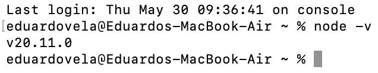
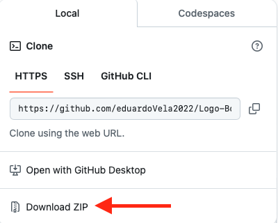
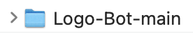
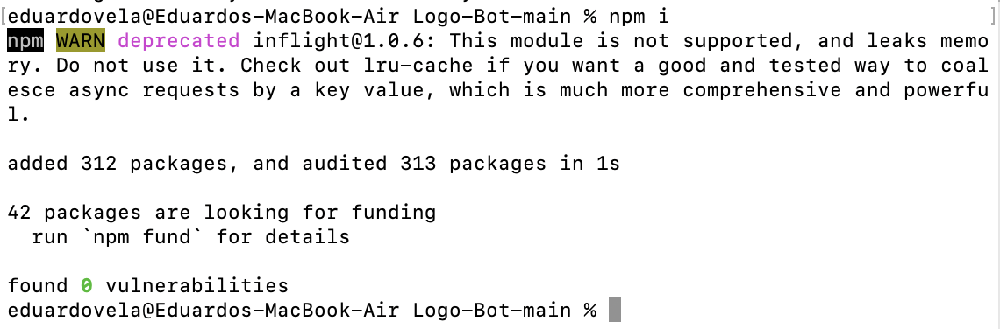
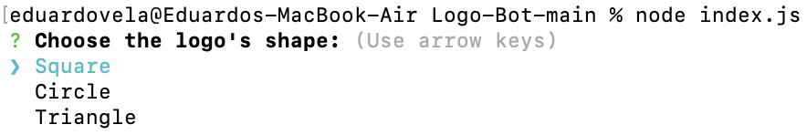
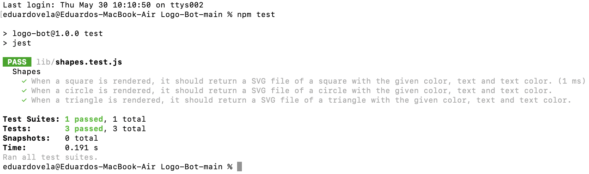

# Logo Bot

## Description

Logo Bot allows you to generate a simple logo and its SVG file. I built this project to continue practicing the usage of NPM modules in a project, and to practice the Object Oriented Programing paradigm. Also in this project I divided my code into modules to keep it more tidy, but it also makes the code more easy to work on and understand, in my opinion. During this project, I learned that creating a parent class allows multiple child classes to inherit its attributes and methods, which improves the overall reusability of the code.

## Table of Contents (Optional)

- [Installation](#installation)
- [Usage](#usage)
- [Credits](#credits)
- [License](#license)
- [Tests](#tests)

## Installation

1. Before downloading the code of the project, check if you have Node.js installed in your computer. To check, run the “node -v” command in your console or terminal of choice, and, if you have it installed, a message displaying the version of Node.js you have installed should appear. If you don’t have Node.js installed, you can install it by clicking the following link: https://nodejs.org/en/download/package-manager/current

2. Then you should download the code by clicking on the green “Code” button, that is located in the main page of the Logo Bot GitHub repository. And, after clicking on it, choose the ZIP option. After that, the following folder should have been dowloaded into your system:

3. Now you just have to open a terminal or console and navigate to the project’s folder that you downloaded. Once you are at the project’s folder location inside of the terminal or console, run the “npm i” command and wait for the Node.js modules to get installed. And that’s it. Now you can run the project by running the “node index.js” command.

## Usage

To learn how to use this project check out the following walkthrough video: https://drive.google.com/file/d/1v_ljYQuOpCeCTgfK88lT8pIDTnylkG1v/view?usp=sharing

## Credits

- To connect a parent class with its child classes:
  Mozilla. (n.d.). extends. extends - JavaScript | MDN. https://developer.mozilla.org/es/docs/Web/JavaScript/Reference/Classes/extends

- To create a square SVG logo:
  W3Schools. (n.d.). SVG . SVG Rectangle. https://www.w3schools.com/graphics/svg_rect.asp

- To create a circular SVG logo:
  W3Schools. (n.d.). SVG . SVG Circle. https://www.w3schools.com/graphics/svg_circle.asp

- To create a triangular SVG logo:
  W3Schools. (n.d.). SVG . SVG Polygon. https://www.w3schools.com/graphics/svg_polygon.asp

## License

This project is under the MIT license.

## Tests

To run the tests of this project, navigate to the project’s folder location using a terminal or console of your choice, and run the “npm test” command. After running that command you should see in your terminal or console the following:

